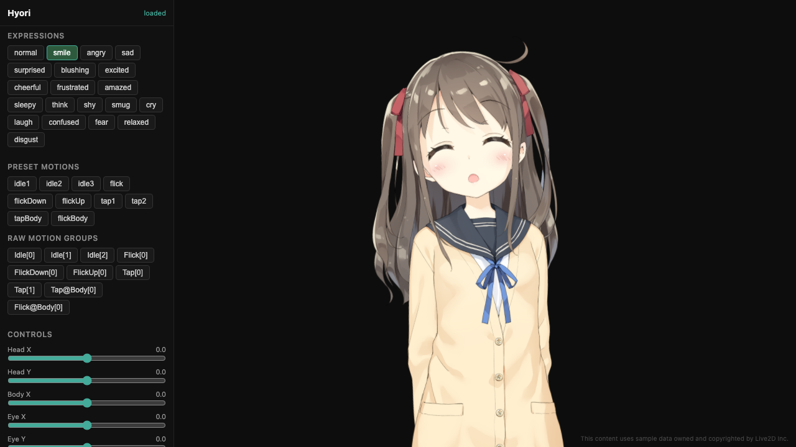

<p align="center">
  <picture>
    <source media="(prefers-color-scheme: dark)" srcset="assets/logo-dark.svg">
    <source media="(prefers-color-scheme: light)" srcset="assets/logo-light.svg">
    
  </picture>
</p>

<h1 align="center">molroo-hyori</h1>

<p align="center">
  <strong>Interactive Live2D Avatar Demo</strong><br/>
  <sub>Technical showcase for the <a href="https://github.com/molroo-ai">molroo</a> emotion engine</sub>
</p>

<p align="center">
  
  
  
</p>

<p align="center">
  <a href="https://molroo-ai.github.io/molroo-hyori/"><strong>Live Demo</strong></a>
</p>

---

<p align="center">
  
</p>

## About

A web-based Live2D avatar with real-time interaction — tap, drag, and chat with Hyori. Built as a showcase for the upcoming **molroo emotion engine**, which will drive avatar expressions and reactions through psychology-based emotion simulation.

### Features

- **Touch interaction** — Tap, flick, and drag the avatar for contextual reactions
- **Drag physics** — Drag to move head/body; hair and accessories sway with momentum
- **20 expression presets** — Layered expression blending on top of motion playback
- **Camera face tracking** — Avatar mirrors your head and eye movement via webcam
- **Idle eye animation** — Procedural gaze with natural saccade patterns
- **Chat UI** — KakaoTalk-style chat rendered behind the character
- **Swappable characters** — Plug in different Live2D models via a simple interface

### Coming Soon

- **molroo emotion engine** — Psychology-based VAD emotion model driving avatar expressions in real-time
- **LLM chat integration** — Conversations powered by molroo-agent with emotion-aware responses

## Quick Start

```bash
git clone https://github.com/molroo-ai/molroo-hyori.git
cd molroo-hyori
npm install
npm run dev
```

> **Note:** The Live2D model file is not included in the repo. Download [Hiyori (hiyori_pro_zh)](https://www.live2d.com/en/learn/sample/) from Live2D's official sample page and place it at `public/models/hiyori_pro_zh.zip`.

## Third-Party Notices

This project uses Live2D Cubism SDK and sample data. See [THIRD-PARTY-NOTICES.md](THIRD-PARTY-NOTICES.md) for full license details.

> Powered by Live2D. This content uses sample data owned and copyrighted by Live2D Inc.

Saccade and zip-loader code adapted from [Project AIRI](https://github.com/moeru-ai/airi) (MIT License).

## License

MIT
